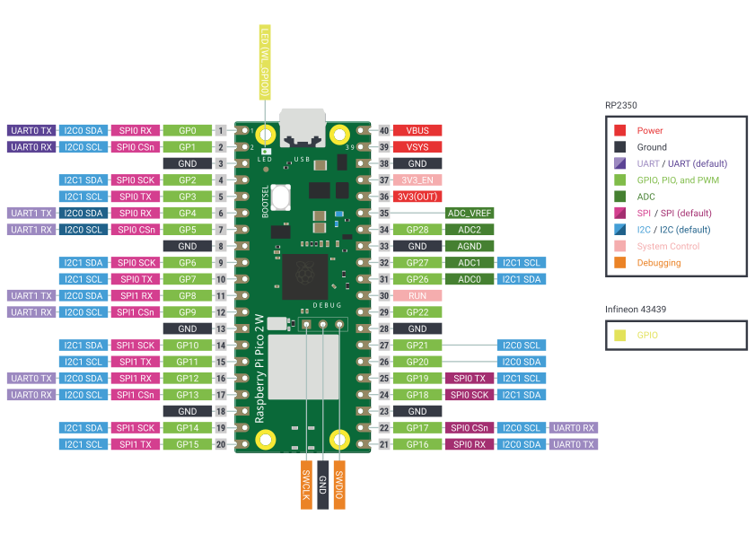

# td2-dev-kit

El objetivo de este kit de desarrollo es proveer un hardware común para las plataformas de la cátedra de Técnicas Digitales II, siendo estas el ESP32 y la Raspberry Pi Pico 2.

## Pinouts de placas de desarrollo

Abajo están los pinouts de las placas de desarrollo que usamos en la cátedra

### ESP32 Devkit C1

### Raspberry Pi Pico 2W

## Kit de desarrollo

Este va a ser nuestro kit de desarrollo para toda la cátedra.

Tiene una variedad de periféricos para poder usar que a continuación vamos a mencionar brevemente.

### Entradas y salidas digitales

| GPIO RPico 2W | GPIO ESP32 | Dispositivo |
| --- | --- | --- |
| 2 | 9 | Output A de encoder rotativo |
| 3 | 10 | Output B de encoder rotativo |
| 12 | 37 | Botón de encoder rotativo |
| 10 | 8 | Buzzer pasivo |
| 11 | 38 | Ánodo LED amarillo |
| 13 | 5 | Cátodo LED rojo (RGB) |
| 14 | 6 | Cátodo LED verde (RGB) |
| 15 | 7 | Cátodo LED azul (RGB) | 

### Entradas analógicas

| GPIO RPico 2W | GPIO ESP32 | Dispositivo |
| --- | --- | --- |
| 26 | 1 | Micrófono |
| 27 | 2 | Potenciómetro |
| 28 | 4 | Termistor NTC |

En los tres casos, es posible anular las tres entradas analógicas a través de los jumpers `JP1`, `JP2` y `JP3` respectivamente. Al hacerlo, se puede conectar alguna entrada analógica externa con los conectores `J5`, `J6` y `J7`.

### Salida analógica

El kit provee una salida analógica a partir de PWM o DAC puro. Es posible medir la salida en `J8` o conectarla a un osciloscopio con el BNC provisto en `J11`.

| Microcontrolador | GPIO |
| --- | --- |
| RPico 2W | 22 |
| ESP32 | 21 |

En ambos casos, el GPIO disponible solo puede generar PWM pero se provee un seguidor de tensión con un filtro pasa bajos para convertir la salida de PWM en una salida analógica pura.

### Sensores y pantallas (I2C)

Todos los sensores y pantallas funcionan en el mismo bus de I2C como esclavos. Entre ellos tenemos:

* BME280 (Sensor de presión, humedad y temperatura).
* BH1750 (Sensor de luminosidad).
* MPU6050 (Acelerómetro y giróscopo).
* SSD1306 (Pantalla monocromática OLED de 128x32).

| Microcontrolador | I2C SDA | I2C SCL |
| --- | --- | --- |
| RPico 2W | 4 | 5 |
| ESP32 | 35 | 36 |

> En el caso del ESP32, es factible elegir cualquier bus. En la Raspberry Pi Pico 2W es el bus de I2C0.

Se provee un conector `J2` con los cuatro pines necesarios para conectar algún otro dispositivo I2C si fuese necesario.

### Tarjeta microSD

El kit provee las conexiones para hacer uso de almacenamiento en una microSD directamente por SPI.

| Microcontrolador | SPI MOSI | SPI MISO | SPI SCK | SPI CS |
| --- | --- | --- | --- | --- |
| RPico 2W | 19 | 16 | 18 | 17 |
| ESP32 | 48 | 45 | 47 | 46 |

> El bus de SPI para la Raspberry Pi Pico es el SPI0 mientras qye en el ESP32 es posible elegirlo.

Es posible anular la SD removiendo `JP4` y usando el conector `J3` para acceder a otro dispositivo SPI externo usando las mismas conexiones.

### UART

Si bien no se provee ningún dispositivo por UART en el propio kit, se deja la conexión disponible para usar a gusto con cualquier dispositivo externo.

| Microcontrolador | UART TX | UART RX |
| --- | --- | --- |
| RPico 2W | 8 | 9 |
| ESP32 | 43 | 44 |

> En la Raspberry Pi Pico 2W el UART usado es el UART1 mientras que en el ESP32 es el UART0.

### Debug Probe

En el caso del ESP32, este viene con un debugger en el propio kit. La Raspberry Pi Pico 2W no posee un debugger propio, por lo que se provee uno embebido en el kit de la cátedra en la forma de un RP2040. Este microcontrolador puede usarse para debuggear la Raspberry Pi Pico 2W o podría usarse como un microcontrolador adicional que agrega otros 14 GPIO disponibles en `J9` y `J10`.

### Test points

Se recopilaron las señales más relevantes en test points a lo largo de todo el kit.

| Test Point | Señal |
| --- | --- |
| TP1 | Salida del micrófono previo a amplificarse |
| TP2 | Canal analógico 0 |
| TP3 | Canal analógico 1 |
| TP4 | Canal analógico 2 |
| TP5 | PWM previo al filtro pasa bajos |
| TP6 | DAC puro |
| TP7 | RGB LED rojo |
| TP8 | RGB LED verde |
| TP9 | RGB LED azul |
| TP10 | LED amarillo |
| TP11 | Salida A del encoder |
| TP12 | Salida B del encoder |
| TP13 | Pulsador del encoder |
| TP14 | UART Tx |
| TP15 | UART Rx |
| TP16 | I2C SDA |
| TP17 | I2C SCL |
| TP18 | SPI MOSI |
| TP19 | SPI MISO |
| TP20 | SPI SCK |
| TP21 | SPI CS |
| TP22 | 3.3V |
| TP23 | 5V |
| TP24 | GND |
| TP25 | RESET |